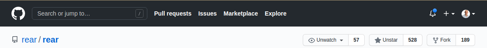
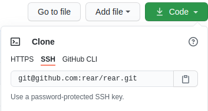
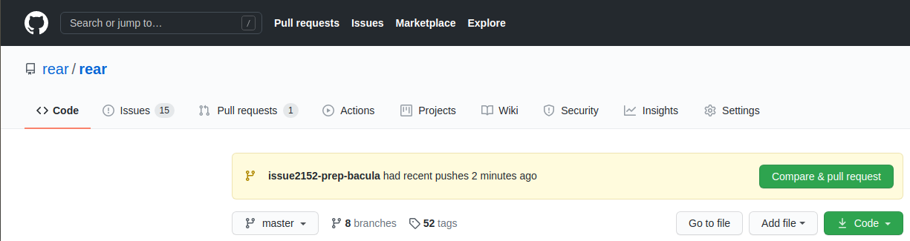
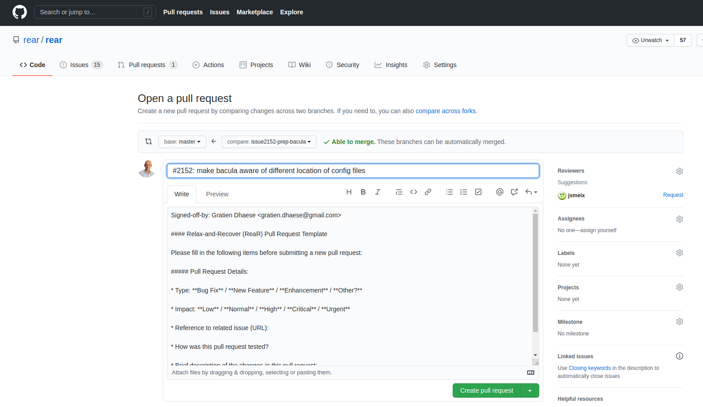
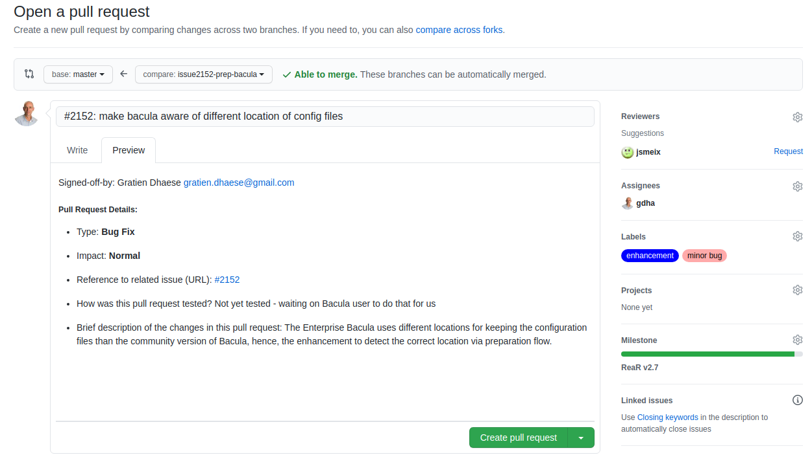

# How to make a pull request with GitHub

## Create a GitHub account

You can skip this section if you are already a member of GitHub - meaning you have an account on GitHub.

If that is not the case, then first [create an account on GitHub](https://www.wikihow.com/Create-an-Account-on-GitHub).

## Fork the ReaR repository

If you never, ever, forked a respository on GitHub then you should first read "[Fork a repository](https://docs.github.com/en/free-pro-team@latest/github/getting-started-with-github/fork-a-repo)" page on GutHub.

To make a fork of ReaR first open your browser and go to the [ReaR Github code page](https://github.com/rear/rear). If you are not yet logged in on Github then first do a sign in and then make a fork by clicking on the fork symbol in the upper right corner - see

<div align="right"></div>

The forking process takes a couple of seconds and you go directly to the forked repository <username>/rear. 

## Clone the ReaR repository

From that moment on you can create a clone of the forked repository to your local system.

<div align="center"></div>

Copy/paste the URL of the SSH section and use that in a Linux window:

```bash
$ git clone git@github.com:YOURNAME/rear.git
$ cd rear
```

Once that is done you have to make your local ReaR repository aware that is is linked to the upstream master if you want to be able to make pull requests in alter phase:

```bash
$ git remote add upstream git@github.com:rear/rear.git
$ git checkout master
$ git fetch upstream
$ git merge upstream/master
```
## Make your working branch of the ReaR repository

At this point your local ReaR repository YOURNAME/rear is completely synced with the upstream master and now you are ready a create a working branch for a fix for an issue or new feature, e.g. issue2152-prep-bacula

```bash
$ git checkout -b issue2152-prep-bacula  upstream/master
Branch 'issue2152-prep-bacula' set up to track remote branch 'master' from 'upstream'.
Switched to a new branch 'issue2152-prep-bacula'
 git branch
* issue2152-prep-bacula
  master
```

In this ReaR repository you are the boss and are working completely independ from the upstream master branch. 
You can always verify if this branch is linked with your *origin* and not with the upstream:

```bash
$ git remote -v
origin	git@github.com:gdha/rear.git (fetch)
origin	git@github.com:gdha/rear.git (push)
upstream	git@github.com:rear/rear.git (fetch)
upstream	git@github.com:rear/rear.git (push)
```

Make your modifications in the code and make sure that you tested it out before making a pull request.
After some time you have all changes in place and you are ready to commit these into your own branch:

```bash
$ git status
On branch issue2152-prep-bacula
Your branch is up to date with 'upstream/master'.

Changes not staged for commit:
  (use "git add <file>..." to update what will be committed)
  (use "git checkout -- <file>..." to discard changes in working directory)

	modified:   conf/default.conf
	modified:   prep/BACULA/default/400_prep_bacula.sh
	modified:   prep/BACULA/default/450_check_BACULA_client_configured.sh
	modified:   prep/BACULA/default/500_check_BACULA_bconsole_results.sh
	modified:   verify/BACULA/default/050_check_requirements.sh
	modified:   verify/BACULA/default/100_start_bacula-fd.sh

no changes added to commit (use "git add" and/or "git commit -a")
```

Commit the modified files into your branch and make sure that you add your signature with the option `-s`:

```bash
$ git commit -a -s -m '#2152: make bacula aware of different location of config files'
[issue2152-prep-bacula d6681f2e] #2152: make bacula aware of different location of config files
 6 files changed, 38 insertions(+), 17 deletions(-)

$ git push upstream issue2152-prep-bacula
Counting objects: 18, done.
Delta compression using up to 8 threads.
Compressing objects: 100% (15/15), done.
Writing objects: 100% (18/18), 2.06 KiB | 2.06 MiB/s, done.
Total 18 (delta 10), reused 0 (delta 0)
remote: Resolving deltas: 100% (10/10), completed with 10 local objects.
remote: 
remote: Create a pull request for 'issue2152-prep-bacula' on GitHub by visiting:
remote:      https://github.com/rear/rear/pull/new/issue2152-prep-bacula
remote: 
To github.com:rear/rear.git
 * [new branch]        issue2152-prep-bacula -> issue2152-prep-bacula
```

Once that went fine open your browser on the [GitHub page of ReaR](https://github.com/rear/rear) and you will see the following:

<div align="center"></div>

Just click on the "Compare & pull request" button which will bring you to the following screen:

<div align="center"></div>

Please fill in the requested information as good as possible so that the ReaR developers and maintainers understand clearly where to PR is about.

<div align="center"></div>

When you are done with a clear description you can press the "Create pull request" button. From that moment on your PR request is in the hand of the ReaR maintainers who will help you to correct missing stuff or provide some enhancements tips and so on. Therefore, it could be that you still have to make a few modifications until all parties are happy with the PR.

Once there is an agreement to merge the PR one of the ReaR maintainers will perform the PR into the upstream code of ReaR and you're done at that moment and you may delete your working branch, in this example issue2152-prep-bacula, e.g.

```bash
$ git checkout master
$ git branch issue2152-prep-bacula -d
```

