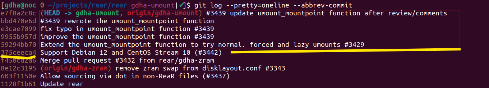

# How to squash git log comments into one line

When you create a pull request you probably have different commits made before it is ready to merge it with the main branch.
We prefer to merge these different commits with *one* commit comment line. With the command `git log --pretty=oneline --abbrev-commit` you get all commit comments in a abbreviated overview:

<div align="center"></div>

To squash our commit logs in one line we need to select the hash just before our hashes. See above picture were we need to rebase to hash #375ceeca4.

We just type the command to make this happen:

```bash
$ git rebase -i 375ceeca4
[detached HEAD 2422d227f] Extend the umount_mountpoint function to try normal, forced and lazy umounts #3429
 Date: Sat Apr 5 08:36:02 2025 +0200
 2 files changed, 50 insertions(+), 22 deletions(-)
Successfully rebased and updated refs/heads/gdha-umount.
```

This opens up a nano editor for merging. And it looks like below:

```bash
pick bbd470e6d #3439 rewrote the umount_mountpoint function
pick e3cae7099 fix typo in umount_mountpoint function #3439
pick 9955b957d improve the umount_mountpoint function #3439
pick 59294bb70 Extend the umount_mountpoint function to try normal. forced and lazy umounts #3429
```

Replace _pick_ with _squash_ on those comments that you wish to hide. You can still edit and modify the comments in the nano editor as well.Exit the editor with Control-X and press Y.

Check with command `git log --pretty=oneline --abbrev-commit` to verify all went well.
